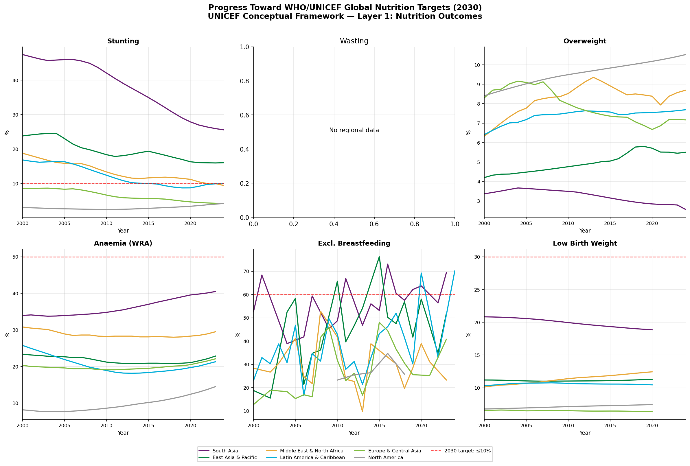
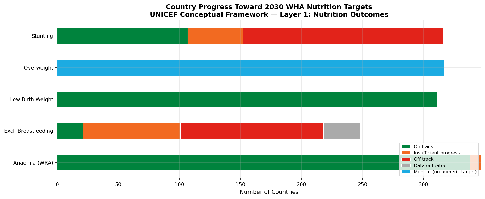
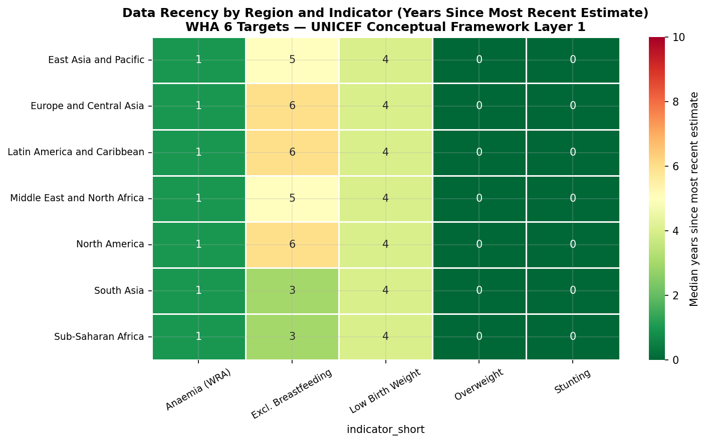
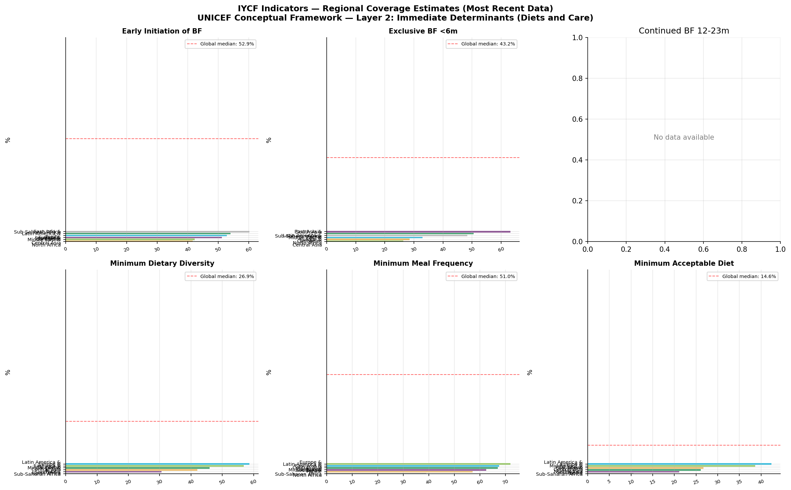
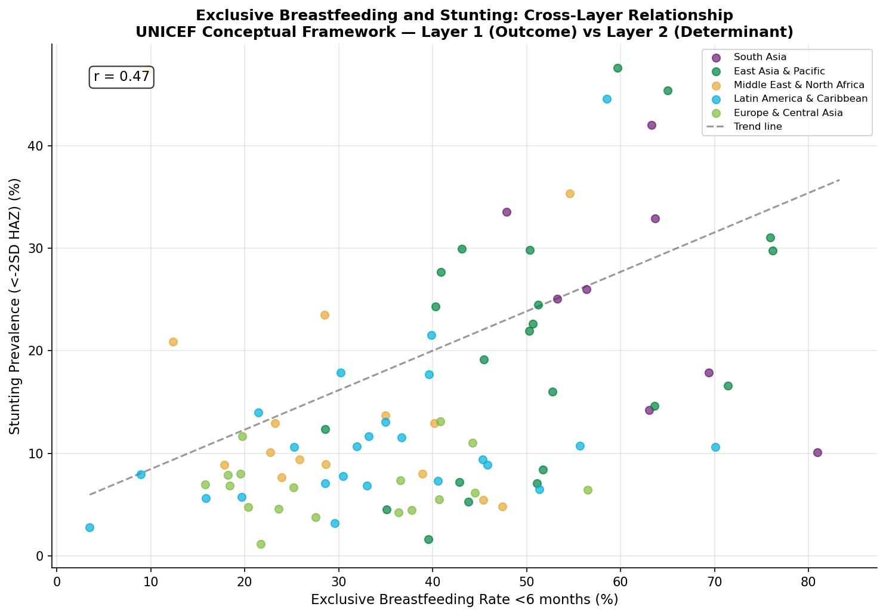
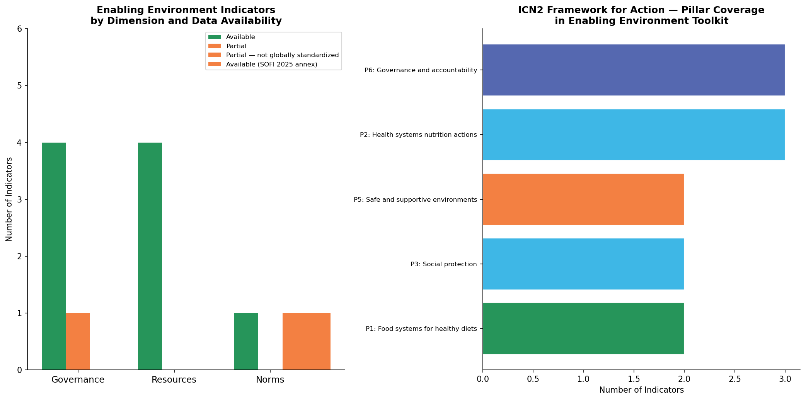
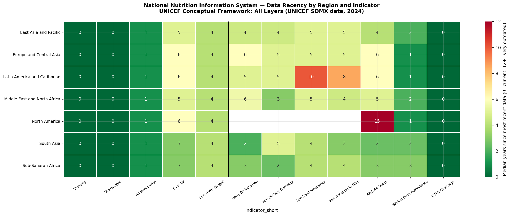
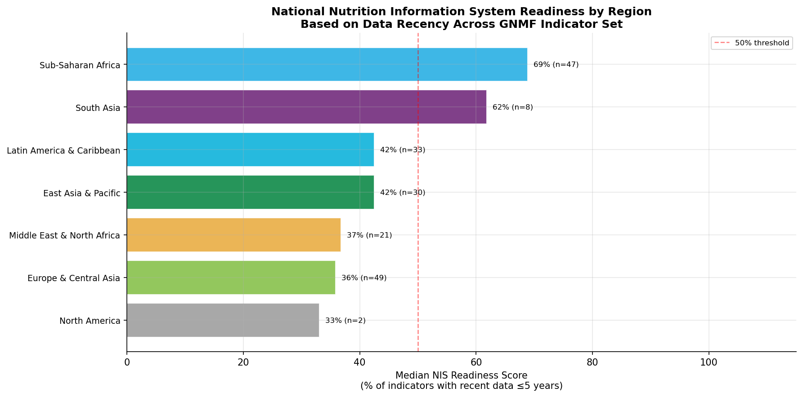

# Global Nutrition Monitoring Framework Dashboard
### A Three-Layer Analysis Built on the UNICEF Conceptual Framework on the Determinants of Maternal and Child Nutrition

**Adam T. Bailes, MPH** | MS Data Science (in progress, Boston University) | August 2026

[](https://www.python.org/)
[](https://data.unicef.org/)
[](#tableau-dashboard)

---

## The Problem This Project Addresses

National nutrition information systems in low- and middle-income countries are typically built around a single data source: a household survey, or a routine HMIS, and focused on a single indicator category (usually child anthropometry). The result is fragmented monitoring that cannot link nutrition outcomes to the determinants that drive them.

This project takes a different approach. It organizes global public data across all four levels of the **UNICEF 2020 Conceptual Framework on the Determinants of Maternal and Child Nutrition**: outcomes, immediate determinants, underlying determinants, and enabling environment - and asks a single practical question:

> *Are countries collecting the right indicators, from the right sources, at the right frequency - to actually monitor the full causal chain that drives nutrition outcomes?*

The answer, for most countries, is no. This project makes that gap visible.

---

## Project Context

This project was developed as part of an active job search in global health data and nutrition analytics roles, where demonstrating fluency with international nutrition indicator frameworks and data systems is directly relevant to the positions being pursued.

The analytical approach — framing indicator selection and gap analysis within the UNICEF Conceptual Framework — reflects the methodological structure of the ToR deliverables: conceptual framework (scope item 1), finalized indicator list with selection criteria (scope item 2), and indicator reference sheets (scope item 3).

---

## Why This Framework

The UNICEF Conceptual Framework (2020) is the global standard for understanding causes of malnutrition. It organizes determinants into four levels:

```
┌─────────────────────────────────────────────────────────────────┐
│ LAYER 4: ENABLING ENVIRONMENT                                   │
│   Governance (policies, budgets, laws, multisectoral coord.)    │
│   Resources (health workers, social protection, financing)      │
│   Norms (gender equity, food environment, breastfeeding support)│
├─────────────────────────────────────────────────────────────────┤
│ LAYER 3: UNDERLYING DETERMINANTS                                │
│   Food (food security — FCS, PoU, FIES, MDD-W)                 │
│   Services (ANC, skilled birth attendance, SAM treatment, VAS)  │
│   WASH (safely managed water and sanitation)                    │
├─────────────────────────────────────────────────────────────────┤
│ LAYER 2: IMMEDIATE DETERMINANTS                                 │
│   Diets (IYCF — MDD, MMF, MAD, dietary diversity)              │
│   Care (EBF, EIBF, continued BF, feeding practices)            │
├─────────────────────────────────────────────────────────────────┤
│ LAYER 1: NUTRITION OUTCOMES (WHA 6 TARGETS)                     │
│   Stunting · Wasting · Overweight · Anaemia (WRA)               │
│   Exclusive Breastfeeding · Low Birth Weight                    │
└─────────────────────────────────────────────────────────────────┘
```

A national nutrition information system that only tracks Layer 1 outcomes cannot identify why those outcomes are not improving. This project demonstrates what a full four-layer monitoring system looks like in practice.

---

## Key Findings

- **Stunting remains at 23.2% globally (2024)** — insufficient pace to reach the 2030 target of ≤10%. West and Central Africa and South Asia show the largest absolute burdens.
- **Exclusive breastfeeding at 47.8% globally (2023)** — progress toward the 60% target, but Sub-Saharan Africa shows wide regional variation masked by aggregate figures.
- **Minimum Dietary Diversity (MDD-C)** — now SDG indicator 2.2.4 (approved March 2025), with only 34% of children 6-23 months meeting the ≥5/8 food groups threshold. Most countries lack current data on this indicator.
- **SAM treatment coverage** shows the largest data gaps across all indicators — fewer than half of countries have estimates from the past 5 years. Administrative data from NutriDash is not yet standardized globally.
- **Enabling environment data is the most fragmented layer** — no single source covers governance, resources, and norms with comparable country coverage. The data gap analysis identifies specific indicators countries should be tracking but currently are not.
- **A suppressor variable pattern** is visible in the cross-layer analysis: exclusive breastfeeding shows a counterintuitive positive association with stunting at the country level, driven by confounding with poverty and food insecurity — high-burden countries have both poor nutrition outcomes and high breastfeeding rates due to the absence of formula alternatives. Multivariate analysis controlling for food security resolves this.

---

## Dashboard Figures

### Layer 1: WHA 6 Target Trends by Region


### Layer 1: Country Progress Classification


### Layer 1 & 2: Data Recency Heatmap


### Layer 2: IYCF Regional Dashboard


### Layer 2 & 3: Cross-Layer — EBF vs Stunting


### Layer 4: Enabling Environment Toolkit


### All Layers: NIS Data Gap Heatmap


### All Layers: NIS Readiness by Region



## Data Sources

| Layer | Indicator Domain | Source | Access |
|---|---|---|---|
| Layer 1 | WHA 6 Targets (stunting, wasting, overweight, anaemia, EBF, LBW) | UNICEF SDMX API via `unicefdata` Python package | Public |
| Layer 2 | IYCF — Diets (MDD, MMF, MAD, EIBF, continued BF) | UNICEF SDMX API | Public |
| Layer 2 | IYCF — Care (EBF, early initiation, breastfeeding practices) | UNICEF SDMX API | Public |
| Layer 3 | Food security (PoU, MDD-C, MDD-W, cost of healthy diet) | FAO SOFI 2025 Data Annex | Public download |
| Layer 3 | Health services (ANC, SBA, DTP3, VAS, SAM treatment) | UNICEF SDMX API | Public |
| Layer 3 | WASH (safely managed water and sanitation) | WHO/UNICEF JMP | Public download |
| Layer 4 | Policy and governance | WHO GINA; WHO BF Scorecard | Public download |
| Layer 4 | Social protection | ILO ILOSTAT | Public download |
| Layer 4 | Food fortification legislation | Food Fortification Initiative | Public |

All data sources are freely available. No data was purchased or licensed.

---

## Repository Structure

```
├── notebooks/
│   ├── 00_data_acquisition.py     # API pulls + manual download instructions
│   ├── 01_data_cleaning.py        # Cleaning, harmonization, gap matrix
│   ├── 02_layer1_outcomes.py      # WHA 6 Target analysis and visualization
│   ├── 03_layer2_determinants.py  # Layer 2: Immediate determinants (IYCF) + Layer 3: Underlying determinants
│   ├── 04_layer3_enabling.py      # Layer 4: Enabling environment toolkit + analysis
│   └── 05_integrated_analysis.py  # Cross-layer synthesis and NIS readiness
├── data/
│   ├── raw/                       # Raw downloads (not committed to GitHub)
│   └── processed/                 # Cleaned analysis-ready files
├── outputs/
│   ├── figures/                   # All matplotlib visualizations
│   └── tables/                    # Tableau-ready CSVs and summary tables
└── docs/
    └── indicator_reference.md     # Indicator definitions and sources
```

---

## Technical Stack

- **Python** (pandas, numpy, matplotlib, seaborn)
- **unicefdata** — official UNICEF Python package for SDMX API access
- **Tableau Public** — interactive dashboard (see link above)
- **GitHub** — version control and public portfolio hosting

---

## Analytical Capabilities Demonstrated

| Capability | Where in repo |
|---|---|
| API data acquisition (UNICEF SDMX) | `00_data_acquisition.py` |
| Multi-source data cleaning and harmonization | `01_data_cleaning.py` |
| Time series trend analysis (2000-2024) | `02_layer1_outcomes.py` |
| Data gap matrix construction and visualization | `01_data_cleaning.py`, `05_integrated_analysis.py` |
| Cross-layer correlation analysis (suppressor variable) | `05_integrated_analysis.py` |
| Composite index construction (NIS Readiness Score) | `05_integrated_analysis.py` |
| Indicator reference toolkit with metadata | `04_layer3_enabling.py` |
| Tableau Public dashboard | See dashboard link |

---

## Tableau Dashboard

*[Link to be added upon publication to Tableau Public]*

Dashboard pages:
1. **Framework Overview** — four-layer UNICEF Conceptual Framework with indicator mapping
2. **WHA 6 Targets (Layer 1)** — world map + regional trend lines + 2030 target progress
3. **Immediate Determinants (Layer 2)** — IYCF regional coverage dashboard
4. **Underlying Determinants (Layer 3)** — food security, health services, WASH coverage
5. **Data Gap Assessment** — country-level NIS readiness heatmap across all layers
6. **Enabling Environment Toolkit (Layer 4)** — interactive policy indicator reference

---

## Context

This project was developed as a portfolio demonstration alongside an application to the UNICEF Nutrition Monitoring Guide Consultant position (ToR reference TMC0005123, August 2026). The consultancy calls for the development of a global guide consolidating nutrition indicators for national information systems across the same thematic domains analyzed here.

The analytical approach — framing indicator selection and gap analysis within the UNICEF Conceptual Framework — reflects the methodological structure of the ToR deliverables: conceptual framework (scope item 1), finalized indicator list with selection criteria (scope item 2), and indicator reference sheets (scope item 3).

---

## Author

**Adam T. Bailes, MPH**
Senior Nutrition and Public Health Analyst
20+ years experience — UNICEF, Save the Children, World Bank, IOM
Countries: Ethiopia, Zimbabwe, Zambia, Timor-Leste, Malawi, Sierra Leone

GitHub: [github.com/atbailes71](https://github.com/atbailes71)
LinkedIn: [linkedin.com/in/adam-bailes-458a35b](https://linkedin.com/in/adam-bailes-458a35b/)
